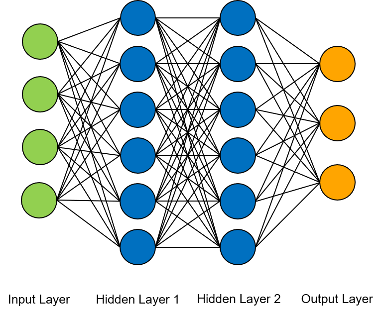

# iris-neural-network
Small example of a deep feed forward neural network solving the popular iris data classification.

## Requirements
you can install all the requirements by simply using pip
```
pip install requirements.txt
```

## Basics
This script uses the Tensorflow framework (Keras) to create a basic 4 layer neural network, consisting of an input layer, two hidden layers and one output layer. You can see the architecture of the network below. 



As the dataset consists of 4 features, the neural network has 4 input neurons. The inputs are forwarded to two hidden layers of 6 neurons each. The computed values are then forwarded to the output layer. As there are 3 possible classes, the output layer consists of 3 neurons, one neuron for each class. 

## Parameters
As an **activation function**, the hidden layers use the Rectified Linear Units (relu) function, the output layer uses a sigmoid. 
As **loss function**, the categorical crossentropy was used.
As optimizer, adam was used.
